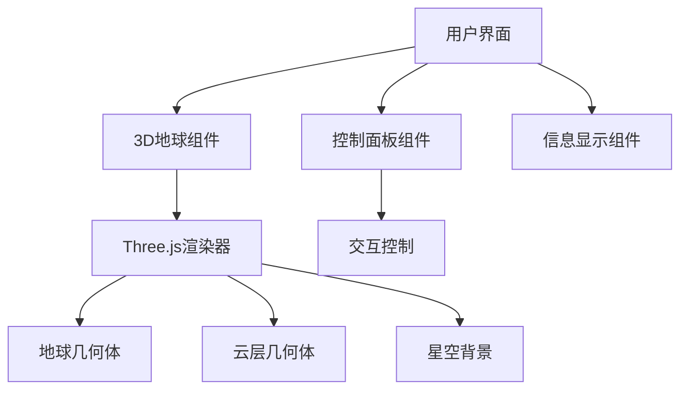

## 1. Architecture Design

## 2. Technology Description
- **前端：React@18 + three.js@0.160 + @react-three/fiber@8 + @react-three/drei@9 + tailwindcss@3 + vite@5**
- **初始化工具：vite-init**
- **后端：不需要**
- **数据库：不需要**

## 3. Route Definitions
| Route | Purpose |
|-------|---------|
| / | 主页面，展示3D地球 |

## 4. API Definitions (if backend exists)
无需后端API

## 5. Server Architecture Diagram (if backend exists)
无需后端

## 6. Data Model (if applicable)
无需数据模型
